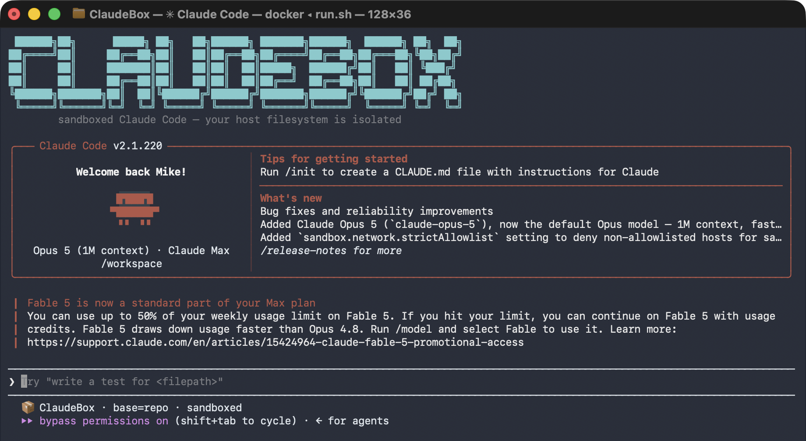

# ClaudeBox

Run [Claude Code](https://github.com/anthropics/claude-code) inside a throwaway Docker
container. The agent runs with `--dangerously-skip-permissions` (no per-action approval
prompts), but it can only see what you explicitly mount — your real home directory and the
rest of your filesystem stay untouched.

The container is built on `node:lts-trixie-slim` and ships with `git`, `bash`, `curl`,
[RTK](https://github.com/rtk-ai/rtk) (a token-saving command wrapper, telemetry disabled),
and the Claude Code CLI. It runs as a non-root `claude` user because Claude Code refuses to
run as root when permissions are skipped.



## Why use this?

- **Run Claude Code unattended.** `--dangerously-skip-permissions` lets the agent act without
  stopping to ask, which is convenient but risky on your real machine. A container bounds the
  blast radius to the directory you mount.
- **Keep your host config clean.** The container works on a *copy* of your config and writes
  nothing back — your real `~/.claude` is never modified. Session state is ephemeral and
  discarded when the container exits.
- **Reproducible environment.** Everyone gets the same Node, git, and CLI versions regardless
  of what's installed on the host.

## Table of contents

- [Prerequisites](#prerequisites)
- [Quick start](#quick-start)
- [Usage](#usage)
- [Configuration base](#configuration-base)
- [How authentication works](#how-authentication-works)
- [How it works](#how-it-works)
- [What's mounted](#whats-mounted)
- [Customization](#customization)
- [Project layout](#project-layout)
- [Troubleshooting](#troubleshooting)
- [FAQ](#faq)
- [Security notes](#security-notes)

## Prerequisites

- **Docker** — any Docker-compatible engine works. Two common options:
  - [**Rancher Desktop**](https://rancherdesktop.io/) — free and open-source (SUSE). Bundles a
    Docker-compatible CLI and runtime; a good default if you want no licensing strings.
  - [**Docker Desktop**](https://www.docker.com/products/docker-desktop/) — free for personal
    use, education, and small businesses, but larger organizations need a paid subscription.

  Either way, make sure the engine is installed and its daemon is running before you launch.
- **Auth** — either an `ANTHROPIC_API_KEY` environment variable, or an existing Claude Code
  login on your host (`~/.claude/.credentials.json`, or the login Keychain on macOS).

> **Architecture note:** the image builds natively on both `amd64` and `arm64` — the
> `Dockerfile` selects the matching RTK binary from `TARGETARCH`, so Apple Silicon needs no
> emulation.

## Quick start

```bash
# 1. Clone
git clone https://github.com/riddlemd/ClaudeBox.git

# 2. From the project you want Claude to work on, launch the sandbox.
#    The image builds automatically on first run (one-time, a few minutes).

# Linux / macOS
/path/to/ClaudeBox/run.sh

# Windows (PowerShell)
C:\path\to\ClaudeBox\run.ps1
```

That's it — Claude Code starts in the container with your current directory mounted at
`/workspace`. Exit with `Ctrl-C` or `/exit`; the container is removed automatically (`--rm`).

## Usage

There are three entry points. They all build the same image and mount your current directory
to `/workspace` inside the container.

### Windows (PowerShell)

```powershell
# From the project you want to work on:
C:\path\to\ClaudeBox\run.ps1

# Or point it at a specific directory:
C:\path\to\ClaudeBox\run.ps1 -ProjectPath C:\some\other\project
```

### Linux / macOS

```bash
# From the project you want to work on:
/path/to/ClaudeBox/run.sh

# Pass a project path as the first argument:
/path/to/ClaudeBox/run.sh /some/other/project

# ...and optionally a custom host ~/.claude directory as the second:
/path/to/ClaudeBox/run.sh /some/other/project /path/to/.claude
```

### Docker Compose

```bash
# Mounts the current directory by default.
ANTHROPIC_API_KEY=sk-ant-... docker compose run --rm claude

# Override the mounted directory with WORKSPACE=
WORKSPACE=/some/other/project docker compose run --rm claude
```

### Building the image manually

The launchers build automatically, but you can build (or rebuild after editing the
`Dockerfile`) by hand:

```bash
docker build -t claude-sandbox .

# Force a clean rebuild, ignoring the layer cache:
docker build --no-cache -t claude-sandbox .
```

## Configuration base

On startup the container seeds its **own writable `~/.claude`** from a read-only *base*, then
works only on that copy. Your host config and the repo template are never written to, and the
copy is discarded when the container exits (state is ephemeral). All entry points default to the
`repo` base; choose another with the `CLAUDE_BASE` variable:

| `CLAUDE_BASE`    | Seeds from                                                                 |
| ---------------- | -------------------------------------------------------------------------- |
| `repo` (default) | The committed **`claude-default/`** template baked into the image.          |
| `host`           | A **curated copy** of your real `~/.claude` (see allowlist below). Run scripts only. |
| `empty`          | Nothing — a clean sandbox.                                                  |

Credentials are **not** part of the base — they're always copied from your host `~/.claude`
(see [How authentication works](#how-authentication-works)), so every base can authenticate.

```bash
# Linux/macOS — override the default:
CLAUDE_BASE=host  ./run.sh
CLAUDE_BASE=empty ./run.sh
```
```powershell
# Windows — via -Base or the CLAUDE_BASE env var:
.\run.ps1 -Base host
.\run.ps1 -Base empty
```

**Host base is curated, not a full mount.** When `CLAUDE_BASE=host`, the run scripts copy only
an allowlist into a temporary directory and mount *that* read-only — the container never sees
the rest of your `~/.claude`. The allowlist is:

```
settings.json  settings.local.json  CLAUDE.md  CLAUDE.local.md
agents/  commands/  skills/  hooks/  output-styles/
```

Deliberately **excluded**: session history (`projects/`, `sessions/`, `history.jsonl`), caches,
`plugins/` (often platform-specific binaries), and `.credentials.json` (handled separately).

> The `host` base is only available through `run.sh` / `run.ps1` — Docker Compose can't portably
> reference your host `~/.claude` across operating systems. Requesting `CLAUDE_BASE=host` under
> Compose falls back to `repo` with a warning.

## How authentication works

Credentials are handled **independently of the base**, so any base can authenticate:

- **Host login** — the run scripts mount `~/.claude/.credentials.json` read-only at
  `/tmp/host-credentials.json`; `entrypoint.sh` copies it into the container's config.
- **macOS Keychain** — macOS stores the login in the Keychain rather than a file, so `run.sh`
  exports the `Claude Code-credentials` item to a mode-`600` temp file, mounts that, and
  deletes it when the container exits. The first run raises a Keychain access prompt.
- **API key** — if you set `ANTHROPIC_API_KEY`, it's passed through to the container.

If neither is available, the run scripts exit with an error before starting the container.

## How it works

When a container starts, `entrypoint.sh` runs as root and does the following before handing
off to Claude Code:

1. **Seeds `~/.claude`** from the selected [base](#configuration-base) (`host`, `repo`, or
   `empty`) by copying it into the container's own writable config directory.
2. **Installs credentials** — if `/tmp/host-credentials.json` was mounted (run scripts), it's
   copied to `~/.claude/.credentials.json`.
3. **Hands ownership** of `~/.claude` to the unprivileged `claude` user (the seed copy ran as
   root).
4. **Writes `~/.claude.json`** — patches your mounted host copy under the `host` base, or writes
   a minimal fresh one otherwise. Either way it sets `installMethod: npm-global`,
   `hasCompletedOnboarding: true`, and trusts `/workspace`, so Claude Code skips the setup wizard
   and folder-trust prompt and never asks the user for any details.
5. **Drops privileges** with `gosu` to the `claude` user, disables RTK telemetry, installs
   the RTK hook, and finally launches:

   ```
   claude --dangerously-skip-permissions --add-dir /workspace
   ```

## What's mounted

| Host                          | Container                  | Purpose                                      |
| ----------------------------- | -------------------------- | -------------------------------------------- |
| Your project directory        | `/workspace`               | The code the agent works on (read-write).    |
| Curated copy of `~/.claude`   | `/opt/host-claude` (read-only) | The `host` base — only the allowlisted config, staged in a temp dir (run scripts, `CLAUDE_BASE=host`). |
| `~/.claude/.credentials.json` | `/tmp/host-credentials.json` (read-only) | Your host login (run scripts). |
| `~/.claude.json`              | `/tmp/host-claude.json` (read-only)      | Host setup state (run scripts, `host` base). |

The `repo` base isn't mounted — it's baked into the image at `/opt/claude-defaults`. The
container's working config (`/home/claude/.claude`) is its own ephemeral directory, not a mount.

## Customization

- **The `repo` base template** lives in `claude-default/`. Edit `claude-default/settings.json`
  to change the container's theme, hooks, or other Claude Code settings; edit
  `claude-default/CLAUDE.md` to give the in-container agent standing instructions. Since `repo`
  is the default base, these apply on a normal run. Rebuild after editing so they're re-baked.
- **The config base** is chosen per run with [`CLAUDE_BASE`](#configuration-base)
  (`host` / `repo` / `empty`).
- **The host allowlist** (what `CLAUDE_BASE=host` copies) is the `HOST_ALLOWLIST` array in
  `run.sh` and `$hostAllowlist` in `run.ps1`.
- **Installed tools** are defined in the `Dockerfile`. Add an `apt-get install` package or another
  `npm install -g` line, then rebuild with `docker build -t claude-sandbox .`.
- **RTK version** is pinned in the `Dockerfile` (`v0.42.3`). Bump the URL to upgrade.
- **Default mounted directory** for Compose is controlled by the `WORKSPACE` variable in
  `docker-compose.yml`.

## Project layout

| File / dir           | Role                                                              |
| -------------------- | ---------------------------------------------------------------- |
| `Dockerfile`         | Builds the Debian image with Node, git, RTK, Claude Code, and the baked-in `claude-default/` template. Picks the RTK binary per `TARGETARCH`. |
| `entrypoint.sh`      | Seeds `~/.claude` from the chosen base, installs credentials, drops to the `claude` user, launches Claude Code. |
| `run.ps1`            | Windows launcher — builds the image if missing, mounts credentials, stages the curated host base when `-Base host`, runs the container. |
| `run.sh`             | Linux/macOS launcher — same behavior as `run.ps1`.              |
| `docker-compose.yml` | Compose entry point; defaults to the `repo` base.               |
| `claude-default/`    | The committed `repo` base template (`settings.json`, `CLAUDE.md`, `RTK.md`), baked into the image read-only. The container never writes here. |
| `.dockerignore`      | Bakes only `claude-default/`'s config files into the image; keeps docs, `.git`, and runtime state out of the build context. |

## Troubleshooting

**`docker: command not found` / "Docker is required"**
Install and start Docker Desktop or Rancher Desktop. `run.ps1` checks for the `docker`
command and exits early with this message if it's missing.

**"Set ANTHROPIC_API_KEY or ensure ... exists"**
The launcher found neither a host credentials file nor an `ANTHROPIC_API_KEY`. Either log in
to Claude Code on your host first, or export the key:

```bash
export ANTHROPIC_API_KEY=sk-ant-...      # Linux/macOS
$env:ANTHROPIC_API_KEY = "sk-ant-..."    # PowerShell
```

**The agent can't see my files**
Only `/workspace` is mounted. Run the launcher *from* the directory you want Claude to work
on, or pass that directory explicitly (`run.sh /path`, `run.ps1 -ProjectPath C:\path`).

**Permission / ownership errors writing config**
`entrypoint.sh` seeds `~/.claude` as root and then chowns it to the `claude` user. If you hit
this, make sure you're launching through the provided scripts (which set `CLAUDE_BASE` and the
mounts correctly) rather than a hand-rolled `docker run`.

**My host customizations aren't showing up in the container**
The `host` base copies only an [allowlist](#configuration-base) — session history and `plugins/`
are intentionally excluded. If a config file you need isn't appearing, add it to the
`HOST_ALLOWLIST` in `run.sh` / `$hostAllowlist` in `run.ps1`. If you're on `docker compose`,
note it uses the `repo` base and ignores your host config entirely.

**`GLIBC_2.39 not found` when building**
RTK's `aarch64` build needs glibc 2.39 or newer, which is why the base is Debian trixie
(glibc 2.41) rather than bookworm (2.36). If you re-pin the `FROM` line to an older Debian
release, the build fails at the `rtk --version` smoke test.

**macOS: "no Claude Code credentials in the macOS Keychain"**
`run.sh` looks for the `Claude Code-credentials` Keychain item. Run `claude` once on the host
to log in, or export `ANTHROPIC_API_KEY` instead. If macOS shows a Keychain access prompt,
approve it — the launcher needs to read that item to pass your login into the container.

**Changes to the `Dockerfile` aren't taking effect**
The launchers only build when the image is *absent*. After editing the `Dockerfile`, rebuild
explicitly: `docker build -t claude-sandbox .` (add `--no-cache` to bypass the layer cache).

## FAQ

**Does it work offline?**
No — Claude Code calls the Anthropic API. You need network access and valid credentials.

**Can I run multiple sandboxes at once?**
Yes. Each launcher invocation starts an independent `--rm` container with its own ephemeral
config, so concurrent sessions don't interfere with each other.

## Security notes

- **Nothing is written back to your host.** Everything from the host (`host` base config,
  credentials, `~/.claude.json`) is mounted **read-only** (`:ro`); the container copies it into
  its own writable config. Your real `~/.claude` is never modified.
- **The `host` base is curated** so the agent can't read your full `~/.claude`. Session history,
  caches, and `plugins/` never enter the container. The one broad exposure is `~/.claude.json`
  (mounted only when you opt into `CLAUDE_BASE=host`), which contains setup state such as your
  account id and MCP server definitions — the default `repo` base avoids it entirely.
- The agent only has access to what you mount: `/workspace` (read-write) and the read-only host
  files above. It cannot reach the rest of your filesystem.
- `--dangerously-skip-permissions` means the agent acts without asking. The container is the
  safety boundary — don't mount directories you aren't willing to let it modify.
- Don't commit secrets to `claude-default/` — `.gitignore` guards credentials and runtime
  state, but the directory is meant to hold only shareable config.

## License

Released under the [MIT License](LICENSE).
